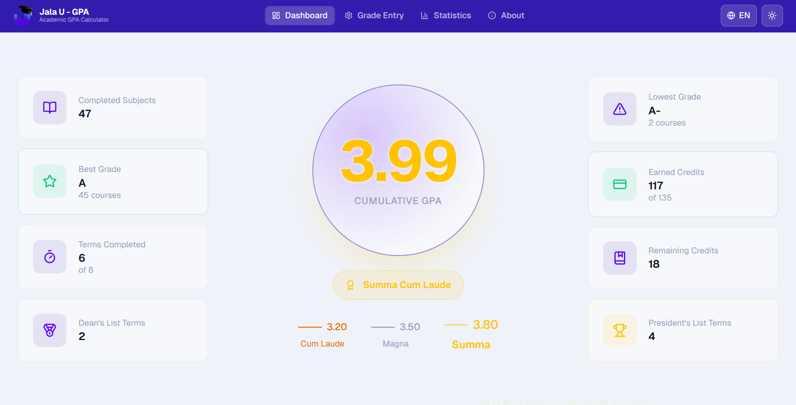
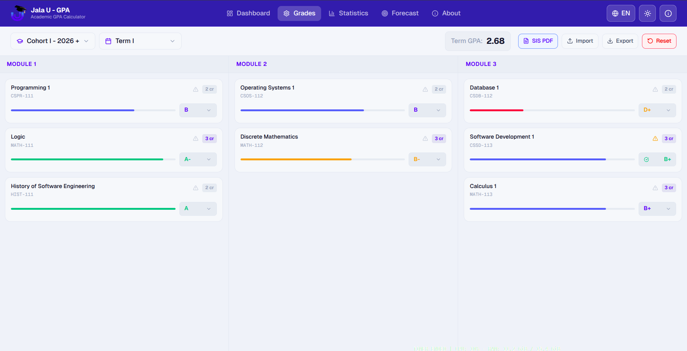
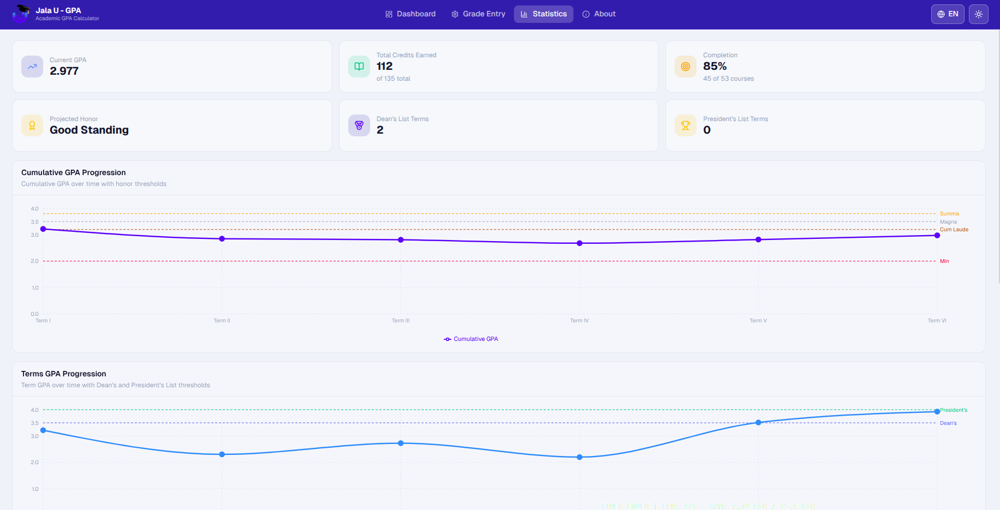
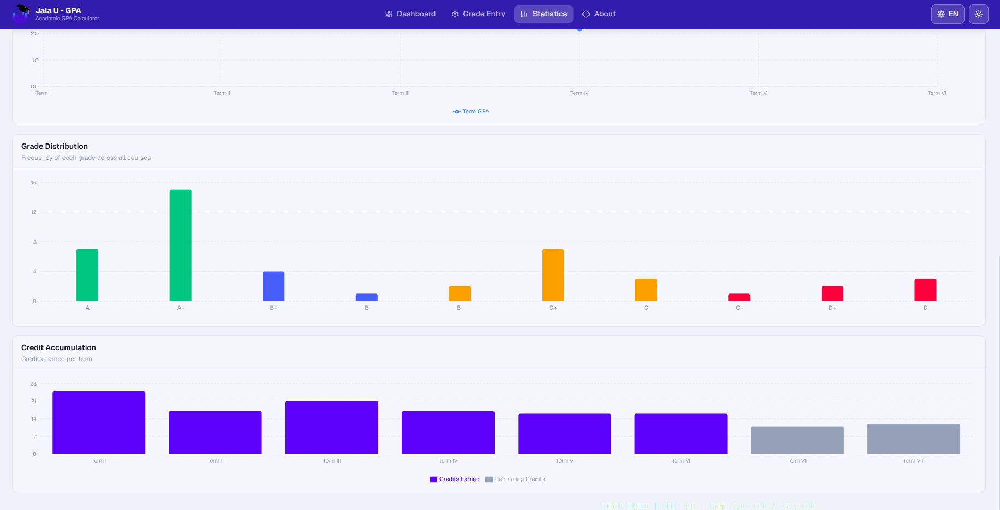
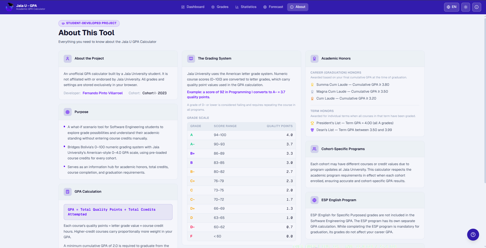
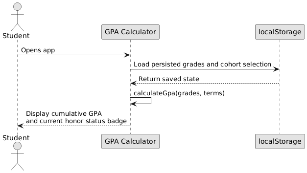
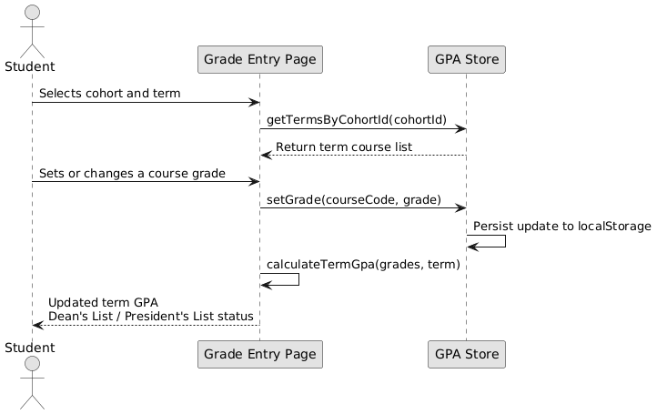
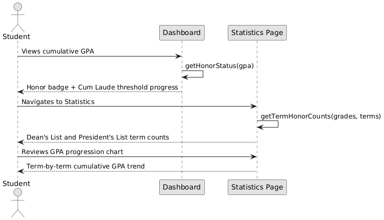

<div align="center">

  

  <br>

# Jala University — GPA Calculator

**A browser-based GPA tracking and simulation tool built unofficially for Jala University students.**

  <br>

[](https://jalau-gpa-calculator.vercel.app/)

  <br>


</div>

---

## Table of Contents

- [Overview](#overview)
- [Why I Built This](#why-i-built-this)
- [Features](#features)
- [App Pages](#app-pages)
  - [Dashboard](#-dashboard)
  - [Grade Entry](#-grade-entry)
  - [Statistics](#-statistics)
  - [About](#-about)
- [Use Cases](#use-cases)
- [Tech Stack](#tech-stack)
- [Getting Started](#getting-started)
  - [Web App — `client/`](#web-app--client)
  - [CLI Tool — `cli/`](#cli-tool--cli)
- [Special Thanks](#special-thanks)

---

## Overview

The **Jala University GPA Calculator** is a "what-if" academic scenario tool designed exclusively for Jala University students. It bridges Bolivia's traditional 0–100 numeric grading system with the American 4.0 GPA scale used by Jala University — a conversion that no existing calculator handles natively.

The app pre-loads the complete course catalog for every cohort, so students never need to manually enter credit hours. Select your cohort, enter your scores, and the GPA is calculated instantly. All data is stored in your browser's `localStorage`. Nothing leaves your device.

---

## Why I Built This

Jala University is the only institution in Bolivia awarding an American-style cumulative GPA alongside its bachelor's degree. As a student, I found it surprisingly difficult to answer basic questions about my own academic standing:

- _What is my cumulative GPA right now?_
- _What grade do I need in my next course to reach the Dean's List?_
- _Am I on track to graduate with honors?_

Existing GPA calculators require manually entering credit hours for every course: a tedious and error-prone process when a program spans 8 terms and over 50 courses. This tool eliminates that friction entirely. It also serves as an information hub for honors criteria, credit requirements, and the nuances of the GPA system at Jala University, which can be difficult to find in one place.

---

## Features

<table>
  <thead>
    <tr>
      <th>Feature</th>
      <th>Description</th>
    </tr>
  </thead>
  <tbody>
    <tr>
      <td><strong>Multi-cohort support</strong></td>
      <td>7 cohorts from I-2023 through I-2026, each with independent grade storage</td>
    </tr>
    <tr>
      <td><strong>What-if scenarios</strong></td>
      <td>Enter or adjust grades freely to simulate future GPA outcomes in real time</td>
    </tr>
    <tr>
      <td><strong>Term honors detection</strong></td>
      <td>Automatic Dean's List (3.5–3.99 GPA) and President's List (4.0 GPA) per term</td>
    </tr>
    <tr>
      <td><strong>Career honors tracking</strong></td>
      <td>Live thresholds for Cum Laude, Magna Cum Laude, and Summa Cum Laude</td>
    </tr>
    <tr>
      <td><strong>Statistics dashboard</strong></td>
      <td>GPA progression chart, grade distribution, and credit accumulation analytics</td>
    </tr>
    <tr>
      <td><strong>Import / Export</strong></td>
      <td>Back up and restore your full grade history as a JSON file</td>
    </tr>
    <tr>
      <td><strong>Internationalization</strong></td>
      <td>Full UI support for English, Spanish, and Portuguese</td>
    </tr>
    <tr>
      <td><strong>Dark / Light theme</strong></td>
      <td>Persisted theme preference across sessions</td>
    </tr>
    <tr>
      <td><strong>Offline-first</strong></td>
      <td>Service worker enabled — works without an internet connection after first load</td>
    </tr>
    <tr>
      <td><strong>Privacy by design</strong></td>
      <td>Zero server-side storage — all data lives exclusively in your browser</td>
    </tr>
  </tbody>
</table>

---

## App Pages

### Dashboard

The home screen provides an at-a-glance view of your academic standing. Your cumulative GPA is displayed at the center, flanked by eight key statistics across two panels. A dynamic badge reflects your current honor status, and a progress bar shows how far you are from the minimum graduation threshold.

<p align="center">
  
  <br>
  <sub>Home page: cumulative GPA with statistics panels, honor status badge, and graduation threshold indicator</sub>
</p>

<table>
  <tr>
    <td><strong>Left panel</strong></td>
    <td>Completed courses · Best grade · Terms completed · Dean's List term count</td>
  </tr>
  <tr>
    <td><strong>Right panel</strong></td>
    <td>Lowest grade · Earned credits · Remaining credits · President's List term count</td>
  </tr>
</table>

---

### Grade Entry

Select your cohort and term, then enter grades for each course across three modules. The term GPA updates instantly and a banner indicates whether you qualify for Dean's List or President's List honors for that term. Grades can only be submitted for terms where all courses have been assigned a grade, ensuring accurate honor status evaluation.

<p align="center">
  
  <br>
  <sub>Grade entry page: three-module layout with cohort/term selectors, per-term GPA, and honor status</sub>
</p>

Course catalogs are pre-loaded per cohort. No manual credit-hour entry is required. On desktop, all three modules are displayed side by side; on mobile, they are presented as tabs.

---

### Statistics

An analytics view with interactive charts for a deeper understanding of academic performance over time.

<p align="center">
  
   
  <br>
  <sub>Statistics page: GPA progression by term, grade distribution, credit accumulation, honors summary, and so on</sub>
</p>

- **GPA Progression** — cumulative GPA trend across all completed terms
- **Grade Distribution** — breakdown of all assigned letter grades
- **Credit Accumulation** — earned versus total credits per term
- **Honor counts** — total Dean's List and President's List terms

---

### About

An information hub covering the American grading system, GPA calculation methodology, academic honors criteria, cohort program differences, the ESP English program, and the app's privacy policy.

<p align="center">
  
  <br>
  <sub>About page: project details, grade conversion table, honors guide, etc.</sub>
</p>

---

## Use Cases

The following sequence diagrams illustrate the primary scenarios this tool was built to support.

---

**Scenario 1 — Check current GPA**



---

**Scenario 2 — Simulate a what-if grade change**



---

**Scenario 3 — Explore honor eligibility**



---

## Tech Stack

### Web App — `client/`

| Category             | Technology                                  |
| -------------------- | ------------------------------------------- |
| Framework            | Next.js 16.1.6 (App Router, React Compiler) |
| Language             | TypeScript 5                                |
| Styling              | Tailwind CSS v4                             |
| State management     | Zustand 5 with `localStorage` persistence   |
| Internationalization | next-intl 4                                 |
| Charts               | Recharts 3                                  |
| Animations           | Framer Motion 12                            |
| Icons                | Lucide React                                |
| Runtime              | Bun                                         |

### CLI Tool — `cli/`

| Category   | Technology                  |
| ---------- | --------------------------- |
| Language   | TypeScript 5.8              |
| Runtime    | Bun                         |
| User input | Node.js built-in `readline` |
| Build tool | TypeScript compiler (`tsc`) |

---

## Getting Started

### Prerequisites

- **[Bun](https://bun.sh/)** ≥ 1.3 — required for both the web app and CLI

---

### Web App — `client/`

The primary project. A full-featured Next.js application with real-time GPA calculation, statistics, and multi-cohort support.

```bash
# 1. Install Bun (skip if already installed)
curl -fsSL https://bun.sh/install | bash

# 2. Navigate to the client directory
cd client

# 3. Install dependencies
bun install

# 4. Start the development server
bun run dev
```

Open [http://localhost:3000](http://localhost:3000) — the app will redirect to `/en` automatically.

```bash
# Build for production
bun run build

# Start the production server
bun run start
```

---

### CLI Tool — `cli/`

A lightweight terminal-based GPA calculator that demonstrates the core calculation algorithms. Useful for exploring GPA scenarios directly from the command line or for understanding the calculation logic.

> **Before running:** The file `cli/src/data/data.ts` contains sample placeholder data. Replace its contents with your own course names, credit values, and grades to match your actual academic record. The file is structured as a reference — the uploaded version uses example data only.

```bash
# 1. Navigate to the CLI directory
cd cli

# 2. Install dependencies
bun install

# 3. Build and run
bun run dev
```

The CLI will display your current GPA summary and prompt you interactively to explore target GPA scenarios for upcoming terms.

```bash
# Compile only (outputs to dist/)
bun run build

# Run the compiled output
bun run start
```

---

## Special Thanks

### Beta Testers

A sincere thank you to the students who tested the app during early development and provided the feedback that shaped it:

| Name                                   | Cohort           |
| -------------------------------------- | ---------------- |
| Luciana Elizabeth Flores Torrico       | Cohort I – 2023  |
| Daniel López Ayala                     | Cohort I – 2023  |
| Irwin Luna Perez                       | Cohort I – 2023  |
| Hugo Fernando Monteiro da Silva Junior | Cohort II – 2023 |
| Pedro Catriel Pereira Torrez           | Cohort I – 2024  |
| Karen Ivonne Cruz Alvarez              | Cohort I – 2025  |
| Jhaziel Mamani Marca                   | Cohort II – 2025 |
| Adriano Pereira da Silva               | Cohort I – 2026  |

### Student Services & Registrar

Special recognition to the **Jala University Student Services & Registrar team** for their patience in clarifying GPA calculation methodology, academic honors criteria, and program requirements. Their support was essential in validating the accuracy of this tool.

---

<div align="center">
  <br>
  <sub>
    Developed by <a href="https://www.linkedin.com/in/fernando-pinto-villarroel/">Fernando Pinto Villarroel</a> — Cohort I – 2023, Jala University
    <br>
    This is an unofficial project and is not affiliated with or endorsed by Jala University.
  </sub>
  <br><br>
</div>
