<div align="center">

  

  <br>

# Jala University — GPA Calculator

**A browser-based GPA tracking and simulation tool built unofficially for Jala University students.**

  <br>

[](https://jalau-gpa-calculator.vercel.app/)

  <br>


[Changelog](CHANGELOG.md)

</div>

---

## Table of Contents

- [Overview](#overview)
- [Why I Built This](#why-i-built-this)
- [Features](#features)
- [App Pages](#app-pages)
  - [Dashboard](#dashboard)
  - [Grade Entry](#grade-entry)
  - [Statistics](#statistics)
  - [Forecast](#forecast)
  - [Canvas Course Playground](#canvas-course-playground)
  - [About](#about)
  - [ESP English Program](#esp-english-program)
- [Guided Tour](#guided-tour)
- [Use Cases](#use-cases)
- [Tech Stack](#tech-stack)
- [Getting Started](#getting-started)
  - [Web App — `client/`](#web-app--client)
  - [Testing](#testing)
  - [CLI Tool — `cli/`](#cli-tool--cli)
- [Changelog](#changelog)
- [Special Thanks](#special-thanks)

---

## Overview

The **Jala University GPA Calculator** is a "what-if" academic scenario tool designed exclusively for Jala University students. It bridges Bolivia's traditional 0–100 numeric grading system with the American 4.0 GPA scale used by Jala University — a conversion that no existing calculator handles natively.

The app pre-loads the complete course catalog for every cohort, so students never need to manually enter credit hours. Select your cohort, enter your scores, and the GPA is calculated instantly. It covers both programs every student takes: the **Commercial Software Engineering** degree and the **ESP (English for Specific Purposes) certificate**, each with its own GPA and rules taken from the most recent student catalog. All data is stored in your browser's `localStorage`. Nothing leaves your device.

---

## Why I Built This

Jala University is the only institution in Bolivia awarding an American-style cumulative GPA alongside its bachelor's degree. As a student, I found it surprisingly difficult to answer basic questions about my own academic standing:

- _What is my cumulative GPA right now?_
- _What grade do I need in my next course to reach the Dean's List?_
- _Am I on track to graduate with honors?_

Existing GPA calculators require manually entering credit hours for every course: a tedious and error-prone process when a program spans 8 terms and over 50 courses. This tool eliminates that friction entirely. It also serves as an information hub for honors criteria, credit requirements, and the nuances of the GPA system at Jala University, which can be difficult to find in one place.

---

## Features

<table>
  <thead>
    <tr>
      <th>Feature</th>
      <th>Description</th>
    </tr>
  </thead>
  <tbody>
    <tr>
      <td><strong>Two programs</strong></td>
      <td>Switch between the Commercial Software Engineering degree and the ESP certificate from the header; each keeps its own grades, GPA, statistics and forecast</td>
    </tr>
    <tr>
      <td><strong>Multi-cohort support</strong></td>
      <td>8 cohorts from I-2023 through II-2026, each with independent grade storage and its own curriculum</td>
    </tr>
    <tr>
      <td><strong>What-if scenarios</strong></td>
      <td>Enter or adjust grades freely to simulate future GPA outcomes in real time</td>
    </tr>
    <tr>
      <td><strong>Term honors detection</strong></td>
      <td>Automatic Dean's List (3.5–3.99 GPA) and President's List (4.0 GPA) per term</td>
    </tr>
    <tr>
      <td><strong>Career honors tracking</strong></td>
      <td>Live thresholds for Cum Laude, Magna Cum Laude, and Summa Cum Laude</td>
    </tr>
    <tr>
      <td><strong>GPA Forecast</strong></td>
      <td>Explore what grades you need for term or cumulative GPA targets, with quick scenarios and optimal grade combination finder</td>
    </tr>
    <tr>
      <td><strong>Academic standing (SAP)</strong></td>
      <td>Rate of progress (credits passed ÷ attempted) next to the GPA, with SAP Risk and Academic Risk alerts based on both catalog conditions (GPA 2.0 and 67%)</td>
    </tr>
    <tr>
      <td><strong>Course retakes</strong></td>
      <td>Register multiple attempts per course with independent credits and grades — all attempts affect GPA, only the passed one counts for completion, and the catalog's three-attempt limit is enforced with warnings</td>
    </tr>
    <tr>
      <td><strong>Statistics dashboard</strong></td>
      <td>GPA progression charts (cumulative and per-term), grade distribution, credit accumulation, and honors overview</td>
    </tr>
    <tr>
      <td><strong>SIS PDF Import</strong></td>
      <td>Upload your Report Card PDF from the official SIS and have Software Engineering and ESP grades imported automatically — with course code mapping, credit adjustment, retake detection and ESP placement level detection</td>
    </tr>
    <tr>
      <td><strong>Canvas Course Playground</strong></td>
      <td>Simulate a single course's grade from its assignments, groups and weights, or import it from a Canvas grades PDF</td>
    </tr>
    <tr>
      <td><strong>Import / Export</strong></td>
      <td>Back up and restore your full grade history as a JSON file; imports restore whichever program(s) the file contains</td>
    </tr>
    <tr>
      <td><strong>Card explanations</strong></td>
      <td>Every dashboard card has an info icon that explains what it measures (hover, tap or keyboard)</td>
    </tr>
    <tr>
      <td><strong>Guided Tour</strong></td>
      <td>Interactive walkthrough of every page, per program, with in-tour language switching and "skip this page"; users coming from version 1 get a one-time "What's new" prompt</td>
    </tr>
    <tr>
      <td><strong>Internationalization</strong></td>
      <td>Full UI support for English, Spanish, and Portuguese</td>
    </tr>
    <tr>
      <td><strong>Dark / Light theme</strong></td>
      <td>Persisted theme preference across sessions</td>
    </tr>
    <tr>
      <td><strong>Offline-first</strong></td>
      <td>Installable PWA that works without a connection after the first visit: every page in every language is cached, grades keep saving locally, and whenever you are online you always get the newest version</td>
    </tr>
    <tr>
      <td><strong>Privacy by design</strong></td>
      <td>Zero server-side storage — all data lives exclusively in your browser</td>
    </tr>
  </tbody>
</table>

---

## App Pages

### Dashboard

The home screen provides an at-a-glance view of your academic standing. Your cumulative GPA is displayed at the center, flanked by key statistics across two panels, each with an info icon explaining it. A dynamic badge reflects your honor status or academic risk (with the reason: GPA or rate of progress), and an alert appears if a course has used all three attempts.

<p align="center">
  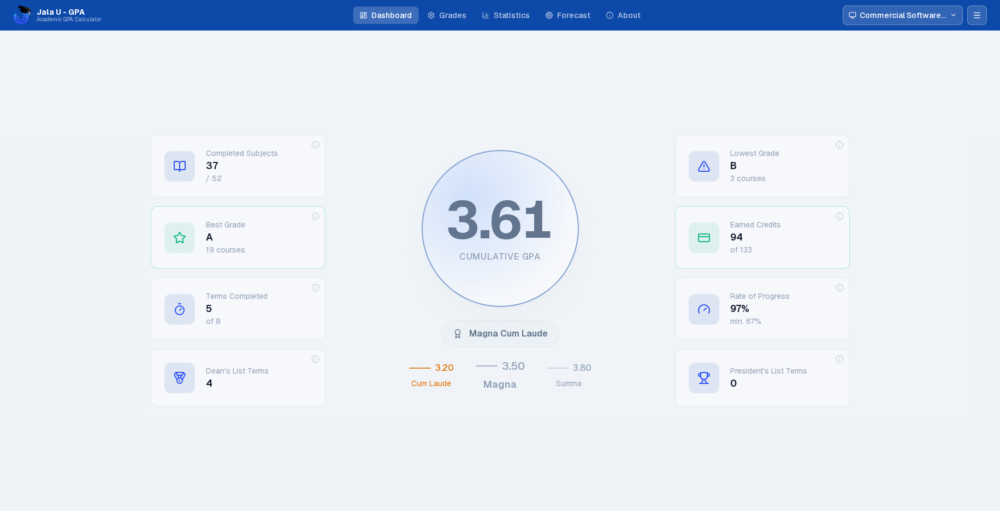
  <br>
  <sub>Home page: cumulative GPA with statistics panels, honor status badge, and honor thresholds</sub>
</p>

<p align="center">
  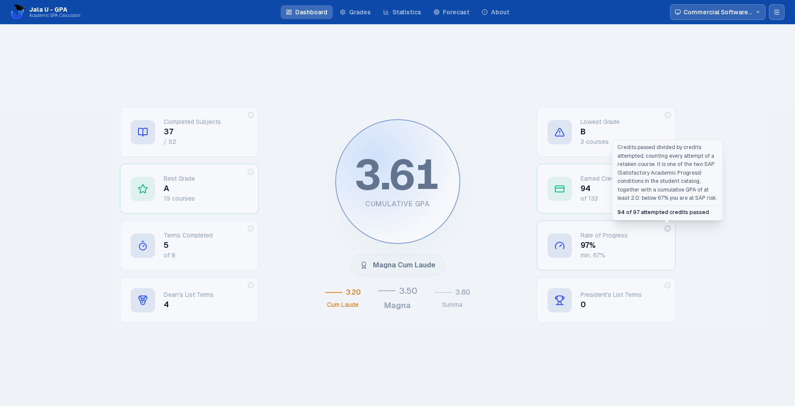
  <br>
  <sub>Every card explains itself: here, the Rate of Progress tooltip</sub>
</p>

<table>
  <tr>
    <td><strong>Left panel</strong></td>
    <td>Completed courses · Best grade · Terms completed · Dean's List term count</td>
  </tr>
  <tr>
    <td><strong>Right panel</strong></td>
    <td>Lowest grade · Earned credits · Rate of progress · President's List term count</td>
  </tr>
  <tr>
    <td><strong>ESP</strong></td>
    <td>Completed ESP courses · Best grade · Levels completed · Lowest grade · Completed ESP labs · Starting level</td>
  </tr>
</table>

---

### Grade Entry

On the **Grades** page (`/grades`), select your cohort and term, then enter grades for each course across three modules. The term GPA updates instantly and a banner indicates whether you qualify for Dean's List or President's List honors for that term.

<p align="center">
  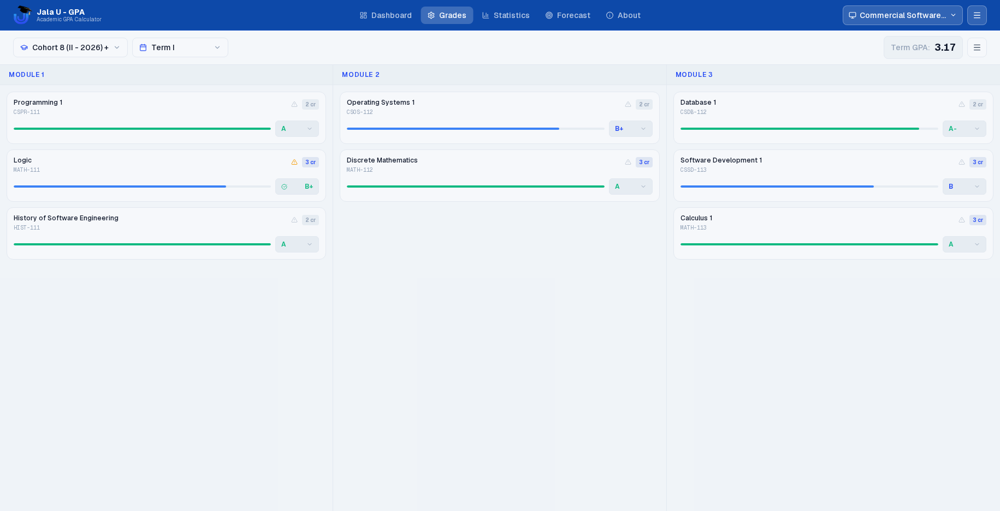
  <br>
  <sub>Grade entry page: three-module layout with cohort/term selectors, per-term GPA, and honor status</sub>
</p>

Course catalogs are pre-loaded per cohort. No manual credit-hour entry is required. On desktop, all three modules are displayed side by side; on mobile, they are presented as tabs.

**SIS PDF Import** — Instead of entering grades manually, you can upload your Report Card PDF directly from Jala University's official SIS (Consolidated > Report Cards, saved with Ctrl+Shift+P). The parser automatically:

- Extracts all courses with their grades, credits, and course codes
- Routes ESP (English program) grades to the ESP career, which keeps its own separate GPA
- Detects retaken courses and creates multi-attempt entries, for both programs
- Sets your ESP placement level from the transcript
- Maps course codes that changed between curriculum revisions (e.g., `FMA-111` to `MATH-111`)
- Adjusts credits when they differ from the cohort defaults (e.g., a course that was 2cr in your cohort but 3cr when you actually took it)

**Course retakes** — If you failed and retook a course, click the warning icon on any course card to register each attempt separately with its own grade and credits (ESP attempts have no credits). All attempts contribute to the GPA calculation, but only the approved attempt counts toward completion statistics. A failing grade (D− or F) can never be marked as passed, and, following the student catalog, a course can be attempted at most three times: the modal warns you at the second failure and flags dismissal at the third.

---

### Statistics

An analytics view with interactive charts for a deeper understanding of academic performance over time.

<p align="center">
  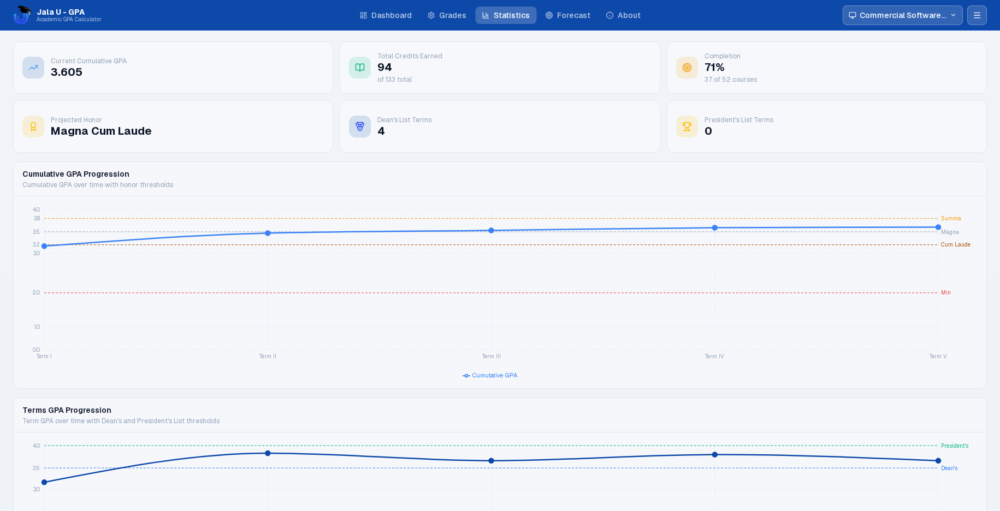
   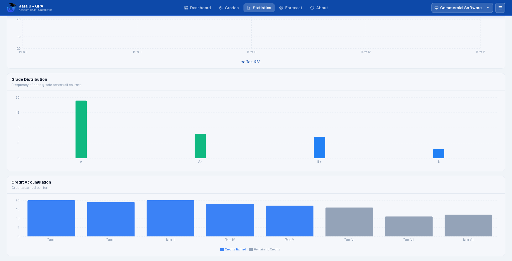
  <br>
  <sub>Statistics page: GPA progression by term, grade distribution, credit accumulation, honors summary, and so on</sub>
</p>

- **GPA Progression** — cumulative GPA trend across all completed terms
- **Grade Distribution** — breakdown of all assigned letter grades
- **Credit Accumulation** — earned versus total credits per term
- **Honor counts** — total Dean's List and President's List terms

---

### Forecast

A planning tool to explore what grades you need to reach specific GPA targets. Choose between term scope (single term) or cumulative scope (overall GPA).

<p align="center">
  
  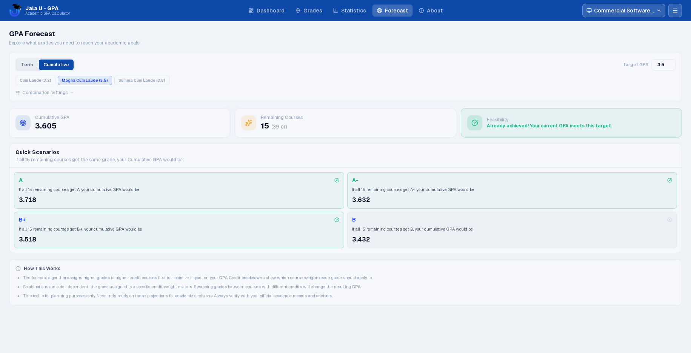
  <br>
  <sub>Forecast page: target GPA input with honor presets, quick scenarios, and optimal grade combination finder</sub>
</p>

- **Target GPA** — Enter a custom target or use honor preset buttons (Cum Laude 3.20, Magna 3.50, Summa 3.80 for cumulative; Dean's List 3.50, President's List 4.00 for term)
- **Quick Scenarios** — Instantly see what your GPA would be if all remaining courses received the same grade
- **Combination Finder** — Finds optimal grade distributions to reach your target, with configurable allowed grades and max results
- **Feasibility indicator** — Shows whether a target is already achieved, achievable, or mathematically impossible

---

### Canvas Course Playground

Opened from the Grades page actions menu, the playground simulates the grade of a single Canvas course. Add assignments, assign them to weighted groups, enter scores and see the course total update live, or import everything at once from a Canvas grades PDF. Playgrounds can be backed up and restored as JSON.

<p align="center">
  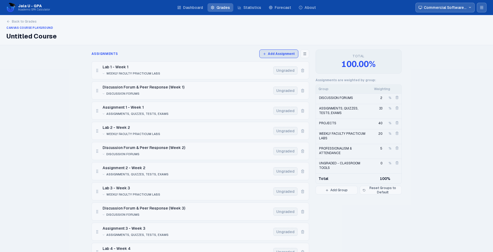
  <br>
  <sub>Canvas Course Playground: assignments list, weighted groups and live course total</sub>
</p>

---

### About

An information hub covering the American grading system, GPA calculation methodology, academic honors criteria, Satisfactory Academic Progress (SAP) and retake rules, cohort program differences, the ESP English program, and the app's privacy policy. The content adapts to the selected program.

<p align="center">
  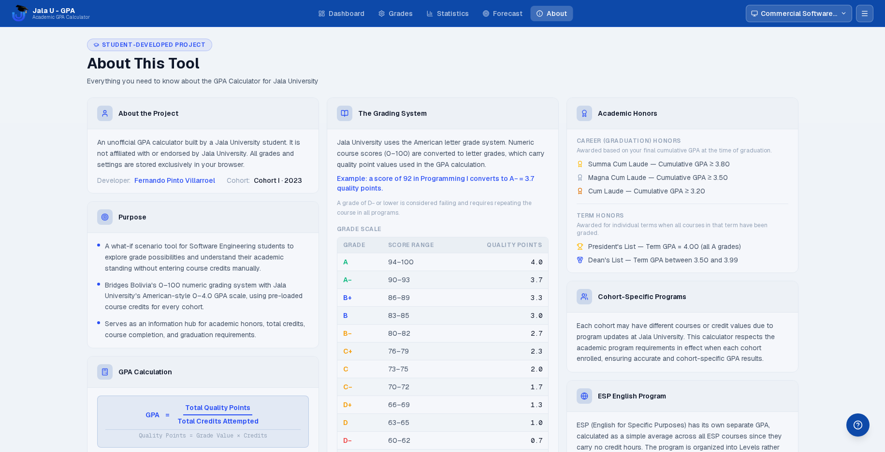
  <br>
  <sub>About page: project details, grade conversion table, honors guide, etc.</sub>
</p>

---

### ESP English Program

Use the career selector in the header to switch between the Software Engineering degree and the ESP (English for Specific Purposes) certificate. Each career keeps its own grades, cohort selection and GPA, all in your browser.

- **Placement level** — Pick Level 1 or Level 2 from your placement test (Level 1 by default). In modules M2 to M5 each course has a Level 1 version (ESP 1, Lab M3L1, Lab M4L1, ESP 2) and a Level 2 version (Lab M2L2, M3L2, M4L2, M5L2); only the one for your level is shown and counted toward your GPA, progress and forecast. Grades entered for the other level are kept (not deleted) and come back if you switch, and the level is detected from your grades when you import a SIS PDF.
- **Levels, not terms** — Courses are grouped in Levels shown side by side. A Level 2 student sees two columns.
- **No credits** — Every ESP course and lab weighs the same in the ESP GPA.
- **Completion** — The program is complete when the ESP courses of your starting level are passed (6 at Level 1, 4 at Level 2; 5 at Level 1 in Cohort I - 2023, which had no ESP module 2). Labs count toward the ESP GPA but never block completion, and Special Labs are optional.
- **Retakes** — Only courses can be retaken (labs cannot), up to three attempts; a third failure means dismissal from ESP and the degree, per the student catalog.
- **No honors** — ESP has no Latin honors, Dean's List, President's List or SAP standing, and its GPA is not part of the degree GPA.

<p align="center">
  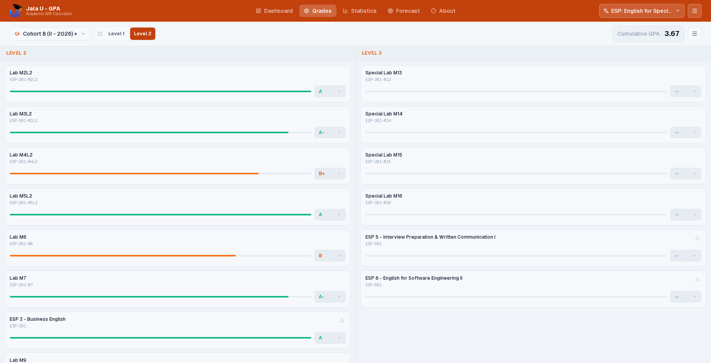
  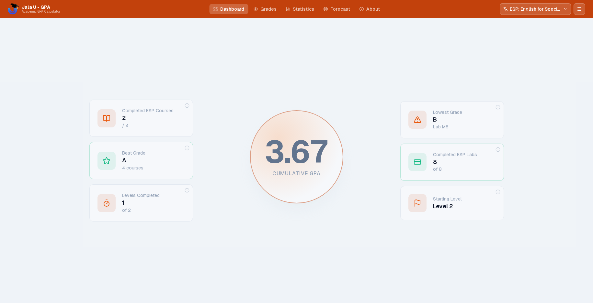
  <br>
  <sub>ESP program: grades by level for a Level 2 student, and the ESP dashboard</sub>
</p>

---

## Guided Tour

First-time users are greeted with an interactive step-by-step tour that walks through every page and feature — from the dashboard and grade entry to statistics, forecast, the Canvas playground and import/export — with steps specific to each program. The tour adapts to screen size (desktop vs. mobile targets), lets you change its language on the fly, can skip a single page or the whole tour, and can be restarted at any time from the header menu. Users who already finished the version 1 tour see a one-time "What's new in version 2" prompt instead.

---

## Use Cases

The following sequence diagrams illustrate the primary scenarios this tool was built to support.

---

**Scenario 1 — Check current GPA**

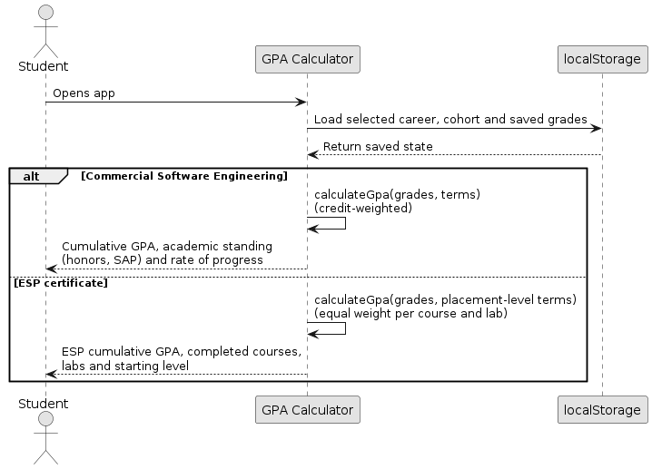

---

**Scenario 2 — Simulate a what-if grade change**

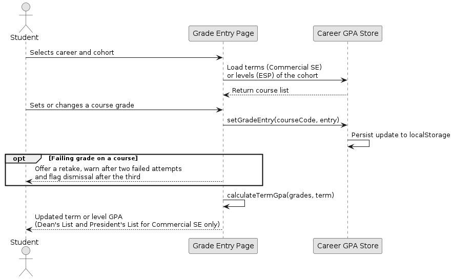

---

**Scenario 3 — Explore honor eligibility and academic standing**

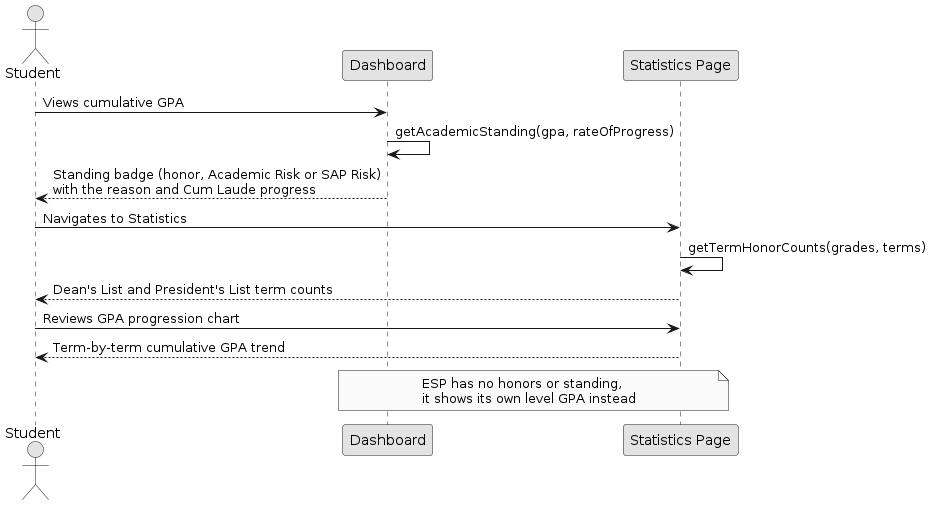

---

## Tech Stack

### Web App — `client/`

| Category             | Technology                                  |
| -------------------- | ------------------------------------------- |
| Framework            | Next.js 16.1.6 (App Router, React Compiler) |
| Language             | TypeScript 5                                |
| Styling              | Tailwind CSS v4                             |
| State management     | Zustand 5 with `localStorage` persistence   |
| Internationalization | next-intl 4                                 |
| Charts               | Recharts 3                                  |
| Animations           | Framer Motion 12                            |
| PDF parsing          | pdfjs-dist (client-side text extraction)    |
| Guided tour          | react-joyride                               |
| Tooltips             | Radix UI Tooltip                            |
| Dialogs              | SweetAlert2                                 |
| Icons                | Lucide React                                |
| Offline / PWA        | Custom service worker generated per build   |
| End-to-end tests     | Playwright                                  |
| Runtime              | Bun                                         |

### CLI Tool — `cli/`

| Category   | Technology                  |
| ---------- | --------------------------- |
| Language   | TypeScript 5.8              |
| Runtime    | Bun                         |
| User input | Node.js built-in `readline` |
| Build tool | TypeScript compiler (`tsc`) |

---

## Getting Started

### Prerequisites

- **[Bun](https://bun.sh/)** ≥ 1.3 — required for both the web app and CLI

---

### Web App — `client/`

The primary project. A full-featured Next.js application with real-time GPA calculation, statistics, and multi-cohort support.

```bash
# 1. Install Bun (skip if already installed)
curl -fsSL https://bun.sh/install | bash

# 2. Navigate to the client directory
cd client

# 3. Install dependencies
bun install

# 4. Start the development server
bun run dev
```

Open [http://localhost:3000](http://localhost:3000) — the app will redirect to `/en` automatically.

```bash
# Build for production
bun run build

# Start the production server
bun run start
```

---

### Testing

The web app is covered by an end-to-end suite of more than 300 Playwright tests (grades, both programs, imports, forecast, statistics, tour, translations and responsive layouts).

```bash
cd client

# Install the browser used by the tests (first time only)
bunx playwright install chromium

# Run the whole suite (starts the dev server automatically)
bun run test:e2e

# Interactive UI mode and the last HTML report
bun run test:e2e:ui
bun run test:e2e:report

# Offline mode against a production build (builds and starts the app on port 3100)
bun run test:e2e:offline
```

---

### CLI Tool — `cli/`

> **Deprecated.** The CLI is the original prototype (equivalent to a version 0.1) and is no longer maintained; it lacks most features of the web app and follows some outdated rules. See [cli/DEPRECATED.md](cli/DEPRECATED.md).

A lightweight terminal-based GPA calculator that demonstrates the core calculation algorithms. Useful for exploring GPA scenarios directly from the command line or for understanding the calculation logic.

> **Before running:** The file `cli/src/data/data.ts` contains sample placeholder data. Replace its contents with your own course names, credit values, and grades to match your actual academic record. The file is structured as a reference — the uploaded version uses example data only.

```bash
# 1. Navigate to the CLI directory
cd cli

# 2. Install dependencies
bun install

# 3. Build and run
bun run dev
```

The CLI will display your current GPA summary and prompt you interactively to explore target GPA scenarios for upcoming terms.

```bash
# Compile only (outputs to dist/)
bun run build

# Run the compiled output
bun run start
```

---

## Changelog

Every notable change, including what version 2 added and which version 1 bugs it fixed, is listed in [CHANGELOG.md](CHANGELOG.md).

---

## Special Thanks

### Beta Testers

A sincere thank you to the students who tested the app during early development and provided the feedback that shaped it:

| Name                                   | Cohort           |
| -------------------------------------- | ---------------- |
| Luciana Elizabeth Flores Torrico       | Cohort I – 2023  |
| Daniel López Ayala                     | Cohort I – 2023  |
| Irwin Luna Perez                       | Cohort I – 2023  |
| Hugo Fernando Monteiro da Silva Junior | Cohort II – 2023 |
| Pedro Catriel Pereira Torrez           | Cohort I – 2024  |
| Victor Angel Pinto Mora                | Cohort I – 2024  |
| Renzo Efrain Abalos Ruiz               | Cohort II – 2024 |
| Karen Ivonne Cruz Alvarez              | Cohort I – 2025  |
| Jhaziel Mamani Marca                   | Cohort II – 2025 |
| Adriano Pereira da Silva               | Cohort I – 2026  |
| Isabella Golubiewski Silva             | Cohort I – 2026  |
| Jose Carranza Angarita                 | Cohort I – 2026  |

### Student Services & Registrar

Special recognition to the **Jala University Student Services & Registrar team** for their patience in clarifying GPA calculation methodology, academic honors criteria, and program requirements. Their support was essential in validating the accuracy of this tool.

### ESP Program

Special thanks to **Gabriela Gutierrez, the ESP Program Coordinator**, and the ESP team, for reviewing the ESP support and helping make it match how the program really works.

---

<div align="center">
  <br>
  <sub>
    Developed by <a href="https://www.linkedin.com/in/fernando-pinto-villarroel/">Fernando Pinto Villarroel</a> — Cohort I – 2023, Jala University
    <br>
    This is an unofficial project and is not affiliated with or endorsed by Jala University.
  </sub>
  <br><br>
</div>
